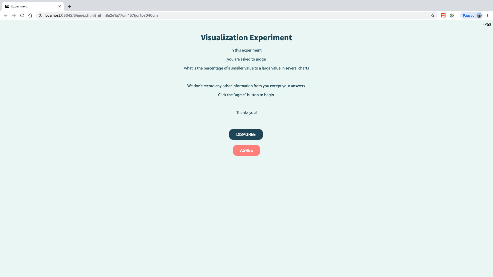
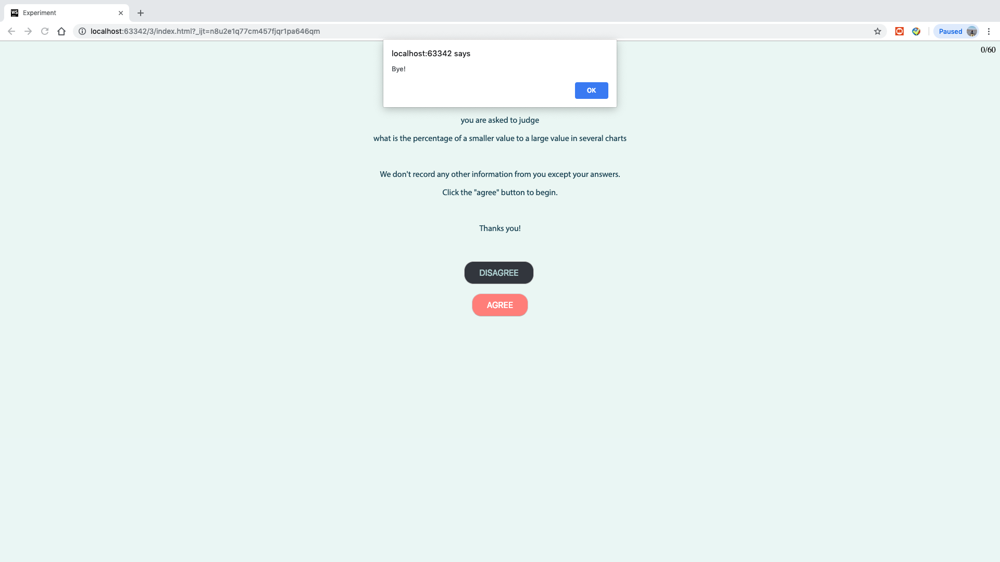
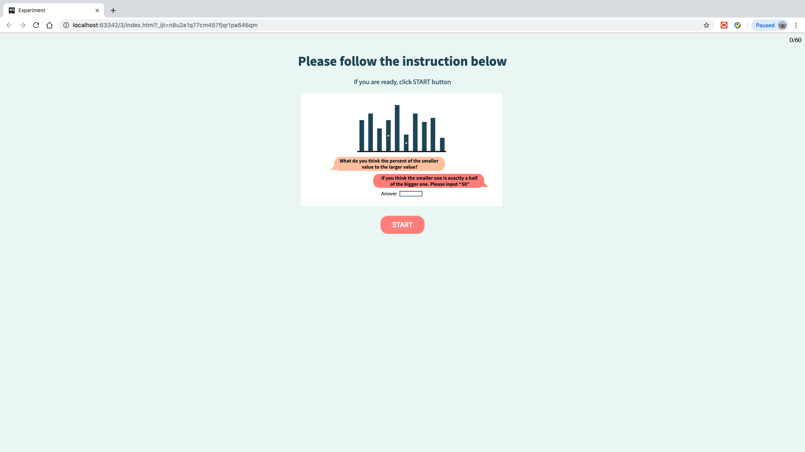
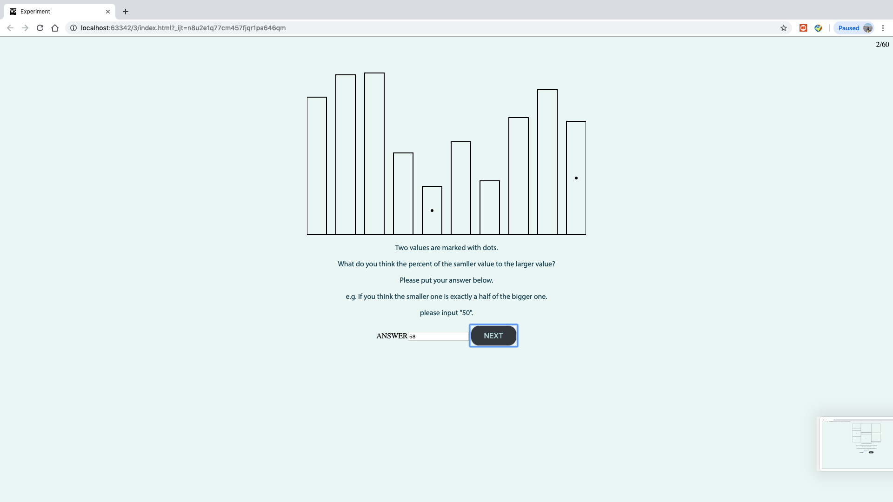
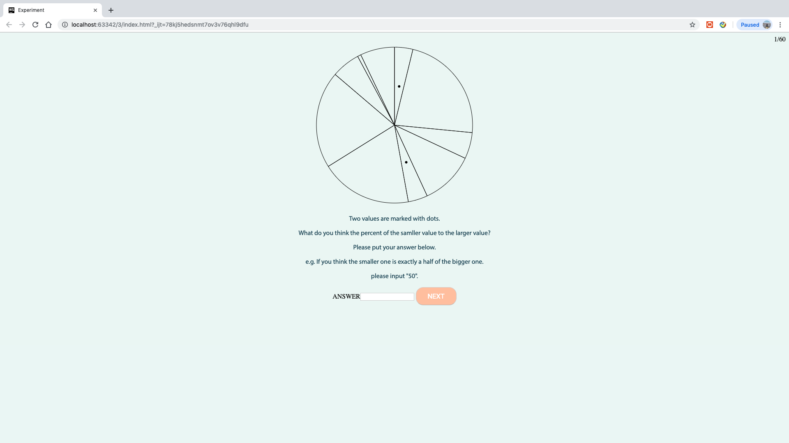
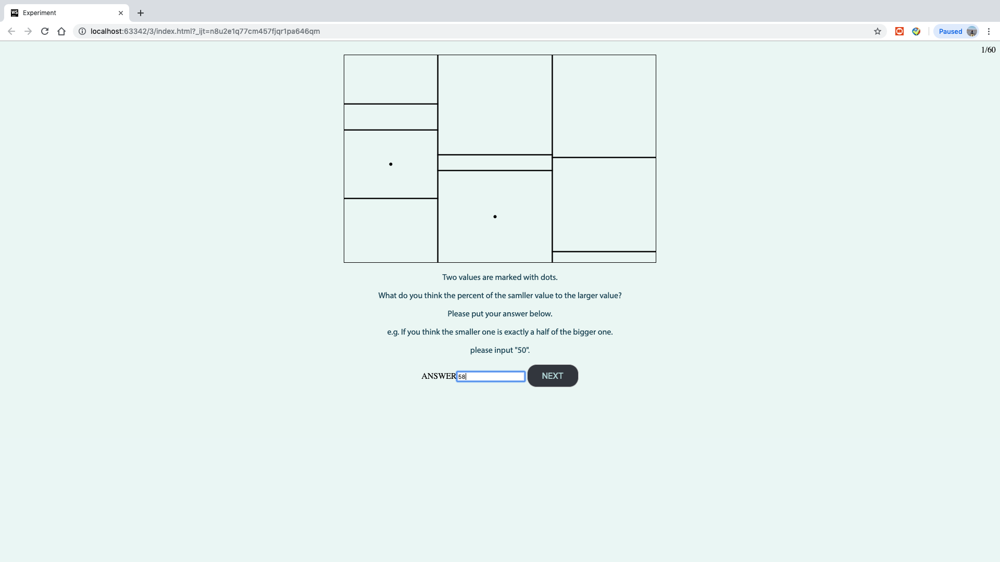
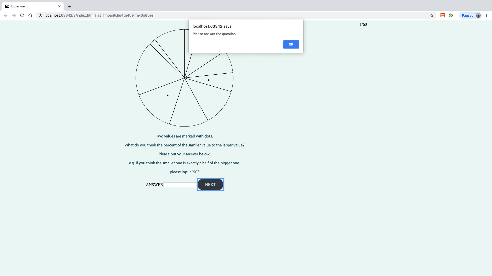
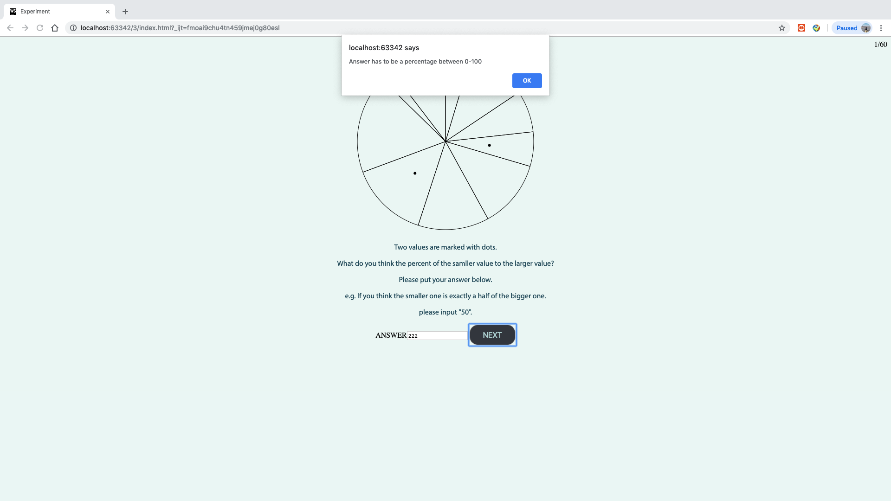
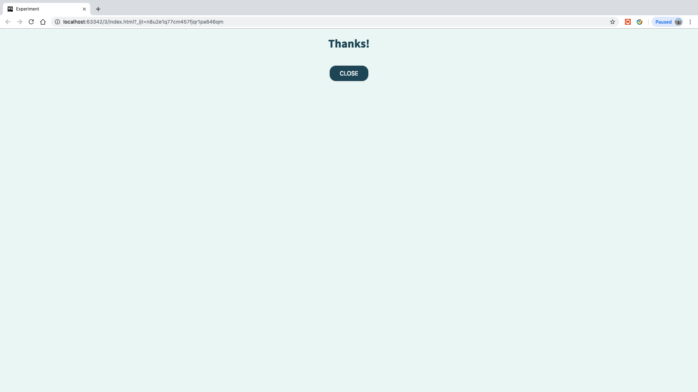

Assignment 3 - Replicating a Classic Experiment  
===

https://mkliu1013.github.io/03-Experiment/

In this Experiment, we need to test the visual difference between different charts. I selected bar chart,pie chart and treemap
for testing. According to the Cleveland and McGill's research result, we already know bar chart is the most effective way, so it can be used as benchmark for other two charts.

For the flow of design, the first page is the welcome page, it indroduces the experimental objective for participants. Then participants can select disagree or agree with this experiment. Because it may take 15 minutes around to finish the test. If click disagree, it will alert "bye". If click agree, it will go for the instruction page.

Jquery is used to realize updating pages. The Instruction page is used to introduce how to conduct the experiment to participants by GIF. With dynamic instruction, it can help participants to understand the rules easily.

After starting the experiment,bar chart, pie chart and treemap will show randomly, each chart will appear 20 times for testing. Progress will be shown on the top of the right to let participants know how many trials they have already finished.

If answer is empty or beyond the 100, alert window will be pop up.

After 60 questions are done, close page will show. Click close button, csv file can be download automatically. 

## Technical

1.Using jquery to realize page update.

2.Progress alert is updated automatically to let participants know how many questions they have finished.

3.Using Adobe Illustrator and Photoshop to make gif for dynamic instruction.

4.CSV file is automatically written after each test.

## Design
1.Color Scheme

2.Using Source Sans Pro and Myriad Pro fonts on text.

3.Hovering effect when hover the buttons.

